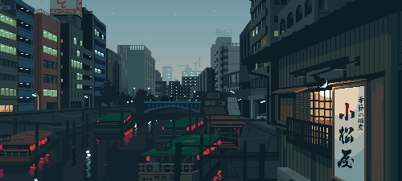

---
<h1 align="center" style="font-weight: bold; font-size: 40px; line-height: 1">Hi there! I'm nguyluky👋 </h1>
<h3 align="center"> A person very passionate about programming</h3>

I am currently working as a freelance programmer

I am currently studying embedded programming, and computer vision 

I have a very special interest in robotics and computers and I really want to work with it 

    
    

---

❖ Languages and tool

---

❖ Github stats summary

